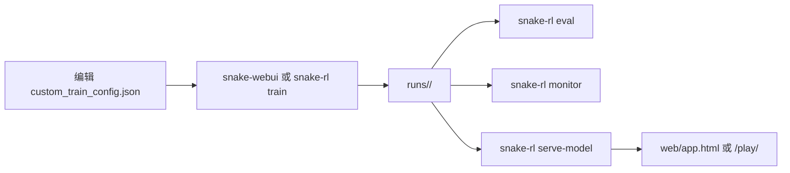

# Snake RL Workspace

一个把浏览器贪吃蛇、PyTorch 强化学习训练、可视化控制台放在同一仓库的完整工作区。

## Highlights

- 浏览器即玩：`web/index.html` 无依赖直接运行
- 训练即工程化：Double DQN + 多训练方案 + 断点续训
- Web 控制台：训练管理、运行记录、TensorBoard、模型演示一体化
- 规则对齐：`web/game.js` 与 `snake_rl/env.py` 语义映射一致

## Quick Start

### 1) 只想玩游戏

直接打开：

```text
web/index.html
```

### 2) 启动可视化控制台（推荐）

```bash
uv sync
uv run snake-webui
```

默认地址：<http://127.0.0.1:7860/>

常用参数：

```bash
uv run snake-webui --port 8080
uv run snake-webui --no-open
```

### 3) 纯命令行

```bash
uv sync
uv run snake-rl train
uv run snake-rl eval --checkpoint runs/<run_name>/checkpoints/best.pt
uv run snake-rl monitor --port 6006
uv run snake-rl serve-model --port 8765 --checkpoint runs/<run_name>/checkpoints/best.pt
```

## Workflow



## Training Schemes

`snake_rl/schemes.py` 统一注册，CLI 与 Web UI 共用。

| 方案 | 核心思路 | 场景 |
| --- | --- | --- |
| `custom` | JSON 全量配置 | 默认推荐，适合长期调参与复现 |
| `scheme1` | 课程学习（小图到大图） | 想先稳定收敛再扩图 |
| `scheme2` | 每局随机地图 | 强化泛化 |
| `scheme3` | `hybrid` + 随机地图 | 跨尺寸泛化优先 |
| `scheme4` | 课程 + 随机 + `hybrid` | 稳定与泛化平衡 |

## Core Commands

### 训练

```bash
uv run snake-rl train
uv run snake-rl train --scheme scheme4
uv run snake-rl train --scheme custom --custom-config custom_train_config.json
uv run snake-rl train --parallel --parallel-workers 4
```

### 恢复训练

```bash
uv run snake-rl train --resume-state runs/<run_name>/state/training.pt
uv run snake-rl train --warm-start runs/<run_name>/checkpoints/latest.pt
```

### 评估

```bash
uv run snake-rl eval --checkpoint runs/<run_name>/checkpoints/best.pt
uv run snake-rl eval --checkpoint runs/<run_name>/checkpoints/best.pt --episodes 30 --render
```

### 监控与推理服务

```bash
uv run snake-rl monitor --port 6006
uv run snake-rl serve-model --port 8765 --checkpoint runs/<run_name>/checkpoints/best.pt
```

## Artifacts

每次训练输出到 `runs/<run_name>/`：

```text
runs/<run_name>/
  checkpoints/
    best.pt
    latest.pt
    ep_XXXXX.pt
  state/
    training.pt
  logs/
    episodes.csv
    episodes.jsonl
    summary.json
  events.out.tfevents.*
  run_config.json
  train_config.json
  run_manifest.json
```

关键文件：

- `best.pt`：评估 / 浏览器演示首选
- `latest.pt`：继续训练和快速调试
- `state/training.pt`：完整恢复训练状态
- `run_config.json`：复现实验最关键快照

## Project Structure

```text
snake_rl/
  cli.py
  train.py
  env.py
  model.py
  agent.py
  schemes.py
  evaluate.py
  inference_server.py
  monitor_server.py
  web_server.py
tests/
web/
docs/
custom_train_config.json
custom_train_config.schema.json
```

## Docs

- [`docs/python-training.md`](docs/python-training.md)：训练与评估说明
- [`docs/custom-train-config.md`](docs/custom-train-config.md)：配置字段说明
- [`docs/custom-train-config.html`](docs/custom-train-config.html)：浏览器参数手册
- [`docs/browser-agent-api.md`](docs/browser-agent-api.md)：浏览器推理接口
- [`docs/js-rule-mapping.md`](docs/js-rule-mapping.md)：JS 与 Python 规则映射

## Development

安装开发依赖：

```bash
uv sync --extra dev
```

运行测试：

```bash
uv run pytest
```

当前测试覆盖：

- CLI 基本行为与错误处理
- 环境奖励/历史恢复逻辑
- 回放池与配置反序列化
- run 上下文与 checkpoint 解析
- hybrid 特征版本校验
