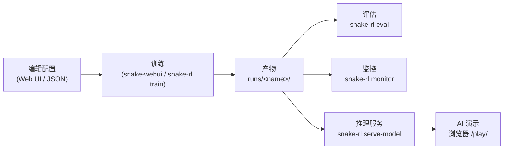

# Snake RL Workspace

一个把浏览器贪吃蛇、PyTorch 强化学习训练、可视化 Web 控制台整合在同一仓库的完整工作区。

## Highlights

- **浏览器即玩**：`web/index.html` 无依赖直接运行，支持键盘 / 触屏 / AI 自动对局
- **四种网络架构**：`tiny`（极轻量 MLP）/ `small_cnn` / `adaptive_cnn` / `hybrid`，从入门到高阶泛化一应俱全
- **灵活训练**：课程学习、随机地图、并行 rollout、断点续训，一套配置文件搞定
- **Web 控制台**：训练管理、运行记录、TensorBoard 监控、模型演示一体化（`snake-webui`）
- **训练即演示**：JS / Python 规则完全对齐，训练好的模型直接在浏览器里跑
- **工程化配置**：JSON Schema 约束的 `custom_train_config.json`，VS Code 即时提示与校验

## Quick Start

### 1) 只想玩游戏

直接用浏览器打开，不需要安装任何东西：

```text
web/index.html
```

### 2) 启动可视化 Web 控制台（推荐）

```bash
uv sync                  # 安装依赖
uv run snake-webui       # 启动控制台
```

打开 <http://127.0.0.1:7860/>，在网页上配置参数、一键训练、查看曲线、演示 AI。

常用参数：

```bash
uv run snake-webui --port 8080     # 换端口
uv run snake-webui --no-open       # 不自动打开浏览器
```

### 3) 纯命令行训练

```bash
uv sync
uv run snake-rl train                     # 默认 custom 方案
uv run snake-rl train --scheme scheme4    # 内置方案
uv run snake-rl train --scheme custom --custom-config custom_train_config.json
```

## Workflow



## Model Types — 选哪个？

| 类型 | 输入 | 参数量 | 支持可变地图 | 推荐场景 |
| --- | --- | --- | --- | --- |
| `tiny` | 10 维标量特征（射线距离 + 食物方向） | ~5K | 是 | 快速实验、教学演示、资源极有限 |
| `small_cnn` | 固定 `[H, W, 9]` 图像 | ~120K | 否 | 固定尺寸入门验证 |
| `adaptive_cnn` | 可变 `[H, W, 9]`，全局平均池化 | ~120K | 是 | **多数场景推荐** |
| `hybrid` | 局部 patch + 10 维全局特征 | ~130K | 是 | 跨尺寸泛化、长期训练 |

> **新手建议**：从 `adaptive_cnn`（默认）开始；想极速迭代可试 `tiny`；追求最强泛化选 `hybrid`。

## Training Schemes

`snake_rl/schemes.py` 统一注册，CLI 与 Web UI 共用同一入口。

| 方案 | 网络 | 核心策略 | 适合场景 |
| --- | --- | --- | --- |
| `custom` | 任意 | JSON 全量配置 | 默认推荐，适合长期调参与复现 |
| `scheme1` | `adaptive_cnn` | 课程学习（小图→大图） | 先稳定收敛再扩图 |
| `scheme2` | `adaptive_cnn` | 每局随机地图 | 强化泛化能力 |
| `scheme3` | `hybrid` | 随机地图 + hybrid 特征 | 跨尺寸泛化优先 |
| `scheme4` | `hybrid` | 课程 + 随机 + hybrid | 稳定与泛化平衡（推荐长训） |

## Core Commands

### 训练

```bash
# 默认 custom 方案
uv run snake-rl train

# 使用内置方案
uv run snake-rl train --scheme scheme4

# 使用自定义配置文件
uv run snake-rl train --scheme custom --custom-config custom_train_config.json

# 并行 rollout（多核加速）
uv run snake-rl train --parallel --parallel-workers 4 --parallel-sync-interval 512
```

### 恢复训练

```bash
# 完整恢复（同实验继续，保留优化器 + 回放池 + 进度）
uv run snake-rl train --resume-state runs/<run_name>/state/training.pt

# 热加载权重（迁移到新配置，只带模型权重）
uv run snake-rl train --warm-start runs/<run_name>/checkpoints/latest.pt
```

### 评估

```bash
uv run snake-rl eval --checkpoint runs/<run_name>/checkpoints/best.pt
uv run snake-rl eval --checkpoint runs/<run_name>/checkpoints/best.pt --episodes 30 --render
```

### 监控与推理服务

```bash
# TensorBoard 实时曲线
uv run snake-rl monitor --runs-dir runs --port 6006

# 推理 HTTP 服务（浏览器 AI 演示用）
uv run snake-rl serve-model --port 8765 --checkpoint runs/<run_name>/checkpoints/best.pt

# 估算训练耗时（开训前建议先跑一下）
uv run snake-rl estimate
uv run snake-rl estimate --quick
```

## Run Artifacts

每次训练输出到 `runs/<run_name>/`：

```text
runs/<run_name>/
  checkpoints/
    best.pt          ← 评估/演示首选（最佳平均奖励时自动保存）
    latest.pt        ← 继续训练和快速调试
    ep_XXXXX.pt      ← 周期性检查点
  state/
    training.pt      ← 完整恢复训练状态（优化器 + 回放池 + 进度）
  logs/
    episodes.csv     ← 每局结构化日志
    episodes.jsonl   ← 详细日志（支持流式追加）
    summary.json
  events.out.tfevents.*  ← TensorBoard 事件
  run_config.json        ← 复现实验的配置快照
  train_config.json      ← 完整训练配置归档
  run_manifest.json
```

## Project Structure

```text
snake_rl/
  cli.py               ← 命令行入口（train / eval / monitor / estimate / serve-model）
  train.py             ← 训练主循环（标准 / 课程 / 并行）
  env.py               ← Python 环境（与 game.js 规则对齐）
  model.py             ← 四种网络（TinyMLP / SmallCNN / AdaptiveCNN / HybridNet）
  agent.py             ← Double DQN agent（含 checkpoint 管理）
  schemes.py           ← 训练方案注册（custom / scheme1-4）
  config.py            ← TrainConfig / EnvPreset 等数据类
  replay_buffer.py     ← 回放池（支持 hybrid / tiny 特殊存储）
  training_state.py    ← 训练状态序列化 / 恢复
  run_context.py       ← checkpoint → run 上下文解析
  run_meta.py          ← 运行记录元数据（供 Web UI 展示）
  evaluate.py          ← 评估脚本
  estimate_time.py     ← 训练耗时估算
  inference_server.py  ← HTTP 推理服务（/v1/act）
  monitor_server.py    ← TensorBoard 启动封装
  web_server.py        ← FastAPI Web 控制台后端
  parallel_rollout.py  ← 多进程 actor rollout
  viz.py               ← Matplotlib 实时曲线
  versions.py          ← checkpoint / 特征 schema 版本常量
  form_field_tips.py   ← Web 表单字段元数据与中文说明
  process_supervisor.py ← 子进程终止（跨平台）
web/
  index.html           ← 独立贪吃蛇游戏页（浏览器直开）
  app.html             ← Web 控制台前端（Vue 3 CDN）
  game.js              ← 游戏引擎 + RL Agent API + tiny 特征提取
  style.css            ← 深色主题样式
tests/                 ← 单元测试
docs/                  ← 详细文档（见下方链接）
custom_train_config.json       ← 默认训练配置（带 Schema 校验）
custom_train_config.schema.json ← JSON Schema
```

## Docs

| 文档 | 说明 |
| --- | --- |
| [`docs/python-training.md`](docs/python-training.md) | 训练、评估、监控完整指南 |
| [`docs/custom-train-config.md`](docs/custom-train-config.md) | 配置字段调参手册 |
| [`docs/custom-train-config.html`](docs/custom-train-config.html) | 浏览器可读参数手册（Web 控制台内嵌） |
| [`docs/browser-agent-api.md`](docs/browser-agent-api.md) | 网页侧 `snakeAgentAPI` 接口说明 |
| [`docs/js-rule-mapping.md`](docs/js-rule-mapping.md) | JS 与 Python 环境规则映射 |

## Development

```bash
uv sync --extra dev    # 安装开发依赖（含 pytest）
uv run pytest          # 运行全部测试
```

当前测试覆盖：

- CLI 基本行为与错误路径
- 环境距离塑形奖励、episode 历史快照恢复
- 回放池序列化（含 tiny 模式）、配置反序列化
- run 上下文与 checkpoint 路径解析
- hybrid / tiny 特征 schema 版本校验
